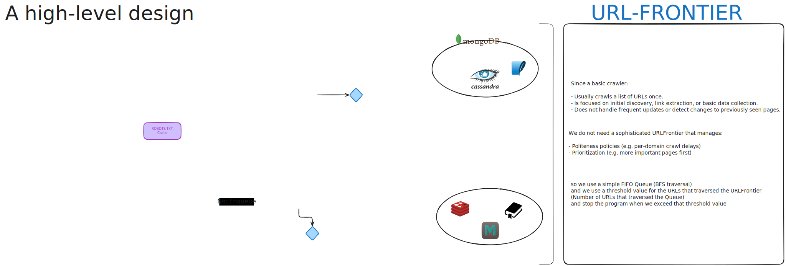
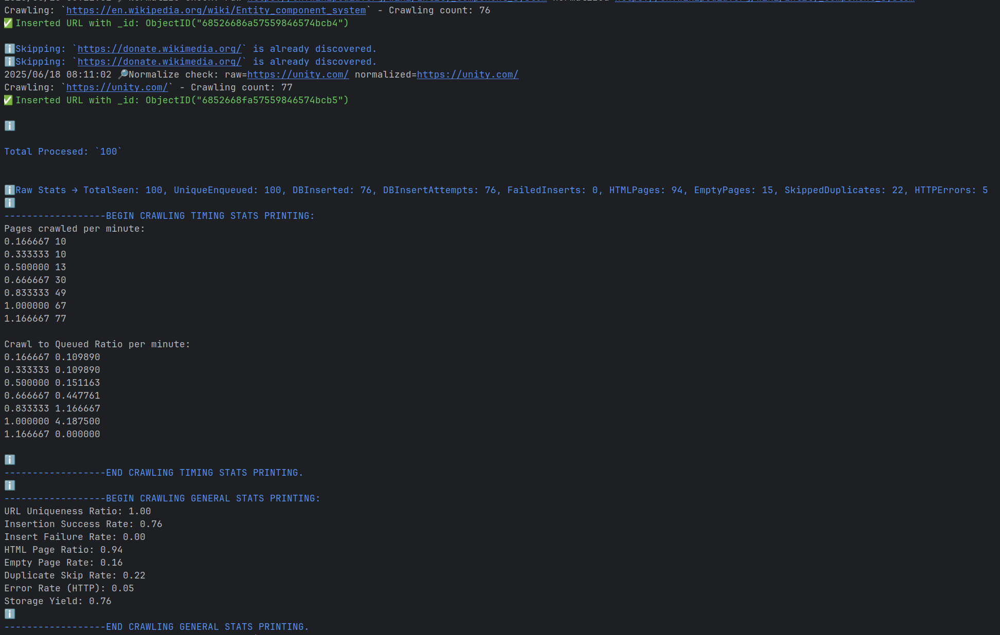
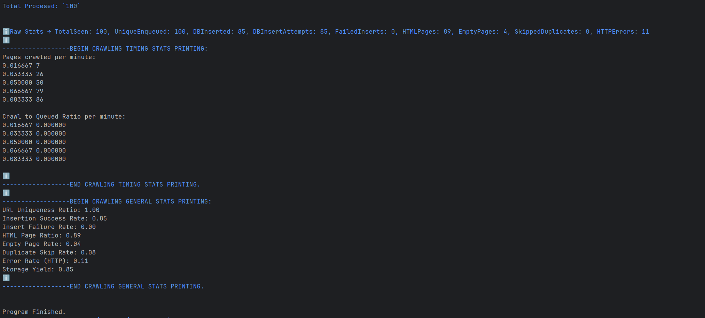
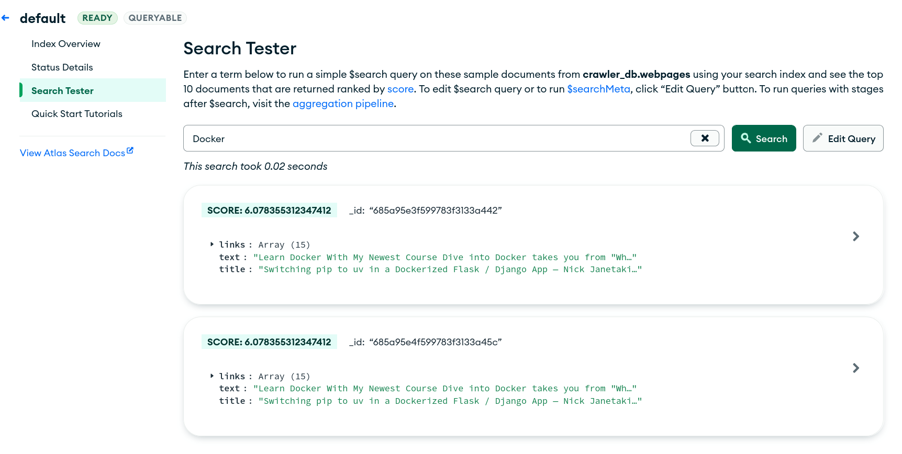

# Basic Web Crawler

## Overview

Just programming a basic web crawler system with Go, mongoDB, Docker and MongoDB-Atlas for prod.

## System Design

### High level design

### System Structure

Describing the system as a whole unit.

### System Behaviour

Describing the activity/flow of the crawling use case.

### System Interaction

Describing the behaviour of the crawling use case.

## Metrics

### Sequential crawling:
See the [CMD Results with GOMAXPROCS set to 8 here](./docs/sequential-results-gomaxprocs-8.txt)

### Concurrent crawling:
See the [CMD Results with GOMAXPROCS set to 8 here](./docs/concurrent-results-gomaxprocs-8.txt)

## Production
I've done a full-text search production test to mimic the flow of a real search engine via MongoDB Atlas Search Tester UI.

## Experiences

### Pros:
- Being able to design and program a crawler from scratch.
- Leveraging Go's productive ecosystem.
- Leveraging Go's concurrency patterns to speed-up crawling by 86%.
- Interacting with a local MongoDB instance for test (Docker containers).
- Interacting with a remote MongoDB instance for prod (MongoDB Atlas).
- Splitting application environments (Docker compose profiling).
- Using UML diagrams.
- Being able to collect a lot of metrics.

### Cons:
- Not able to implement Politeness feature for the URL Frontier.
- Not able to implement Priority feature for the URL Frontier.
- Limited control over data/UI noise.
